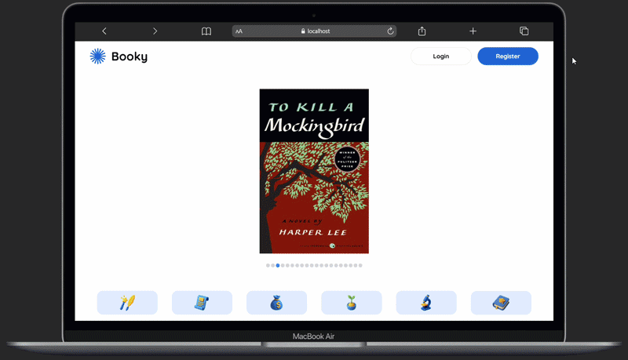

# 🎉 Library Web MVP — Modern Frontend for Digital Libraries

A lightweight, fast, and scalable MVP frontend built for digital library systems. Designed with a clean architecture, smooth UX, and production-ready patterns — perfect for real projects or portfolio showcases.

---

## ⚡ Built Using Today’s Best Stack

**Frontend:** React.js  
**Backend / Services:** Node.js | PostgreSQL | Swagger | Railway  
**State Management & Fetch Data:** Redux Toolkit | TanStack Query | Axios  
**Animations / UI:** Tailwind CSS | Framer Motion  
**Tooling:** TypeScript | Vite
**API Detail 👉** [https://core-api-production-7554.up.railway.app/api-docs/](https://core-api-production-7554.up.railway.app/api-docs/)
**Web App Detail 👉** [https://library-web-mvp.vercel.app/](https://library-web-mvp.vercel.app/)

---

## 🚀 Live Preview

  
**Try it live:** [https://library-web-mvp.vercel.app/](https://library-web-mvp.vercel.app/)

---

## ✨ Key Features

### 🌟 UX & Performance

- ⚡ Optimistic UI — instant feedback on borrow actions
- 🔁 Smart caching & refetch with TanStack Query
- 🧩 Reusable & composable UI components via shadcn/ui
- 🎬 Optional Framer Motion animations for micro-interactions

### 🧱 Architecture

- 🧠 Redux Toolkit for global state
- 🔌 API layer with typed TanStack Query hooks
- 🗂️ Feature-based folder structure for scalability
- Node.js backend services with PostgreSQL
- Swagger for API documentation
- Railway for deployments
- ✨ Type-safe development with React + TypeScript
- 🚀 Blazing fast Vite DX

### 🎨 Design

- Tailwind CSS utility styling
- Clean, modern, responsive layout
- Accessible and keyboard-friendly components

---

## 🧭 Tech Stack

| Category   | Tools                                   |
| ---------- | --------------------------------------- |
| UI         | React, shadcn/ui, Tailwind CSS          |
| State      | Redux Toolkit, TanStack Query           |
| Animations | Framer Motion (optional)                |
| Tooling    | TypeScript, Vite                        |
| Utilities  | Day.js                                  |
| QA         | Jest, React Testing Library, Playwright |

---
